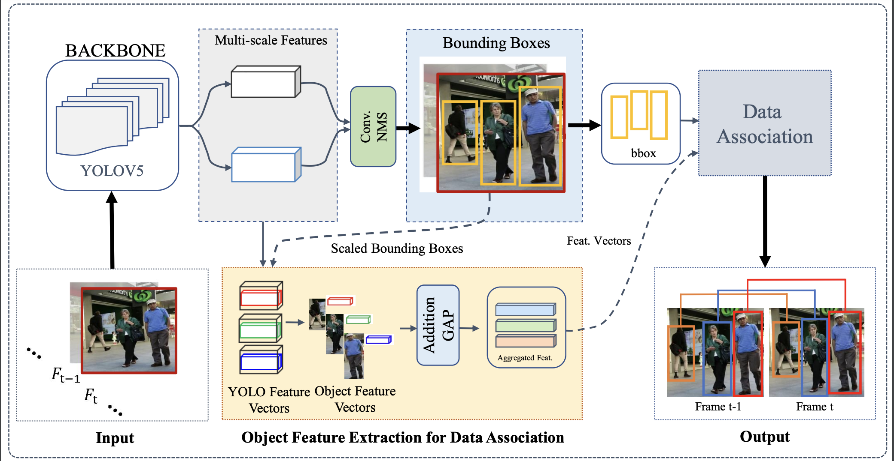
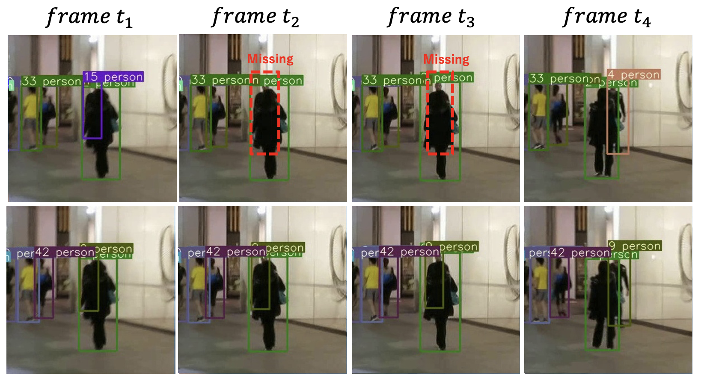
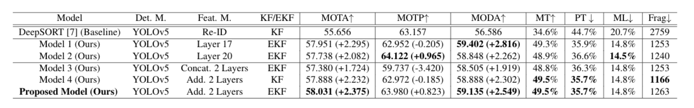

# Multi-Object-Tracker-Based-on-Multi-scale-Representations-of-Objects

This repository includes Pytorch implementation for the following paper:

Multi-Object Tracker Based on Multi-scale Representations of Objects, 2022.

Conghe Xia, Guanqun Ding, Nevrez Imamoglu, Hiroshi Ishikawa, Ryosuke Nakamura


## Before you run the tracker
1. Clone the repository recursively:

`https://github.com/natsumeshow/Multi-Object-Tracker-Based-on-Multi-scale-Representations-of-Objects.git`

2. Make sure that you fulfill all the requirements: Python 3.8 or later with all [requirements.txt](https://github.com/mikel-brostrom/Yolov5_DeepSort_Pytorch/blob/master/requirements.txt) dependencies installed, including torch>=1.7. To install, run:

`pip install -r requirements.txt`

## Tracking sources

Tracking can be run on most video formats

```bash
python3 track.py --source ... --show-vid # show live inference results as well
```

- Video:  `--source file.mp4`
- Webcam:  `--source 0`

## Select a Yolov5 family model

There is a clear trade-off between model inference speed and accuracy. In order to make it possible to fulfill your inference speed/accuracy needs
you can select a Yolov5 family model for automatic download

```bash
python3 track.py --source 0 --yolo_weights yolov5s.pt --img 640  # smallest yolov5 family model
```

```bash
python3 track.py --source 0 --yolo_weights yolov5x.pt --img 1280  # our model use 
```

## Filter tracked classes

By default the tracker tracks all MS COCO classes.

If you only want to track persons I recommend you to get [these weights](https://drive.google.com/file/d/1gglIwqxaH2iTvy6lZlXuAcMpd_U0GCUb/view?usp=sharing) for increased performance

```bash
python3 track.py --source 0 --yolo_weights yolov5/weights/yolov5x.pt --classes 0  # tracks persons, only
```

If you want to track a subset of the MS COCO classes, add their corresponding index after the classes flag

```bash
python3 track.py --source 0 --yolo_weights yolov5/weights/yolov5x.pt --classes 0 2  # tracks cats and dogs, only
```

[Here](https://tech.amikelive.com/node-718/what-object-categories-labels-are-in-coco-dataset/) is a list of all the possible objects that a Yolov5 model trained on MS COCO can detect. Notice that the indexing for the classes in this repo starts at zero.


## MOT compliant results

Can be saved to `inference/output` by 

```bash
python3 track.py --source ... --save-txt
```

## Performance Evaluation
### 1. Visulization Results


### 2. Testing Performance on Baseline and our 5 models



## Acknowledgement
- Baseline model

    We use [Yolov5_DeepSort_Pytorch](https://github.com/mikel-brostrom/Yolov5_DeepSort_Pytorch) as our baseline.
